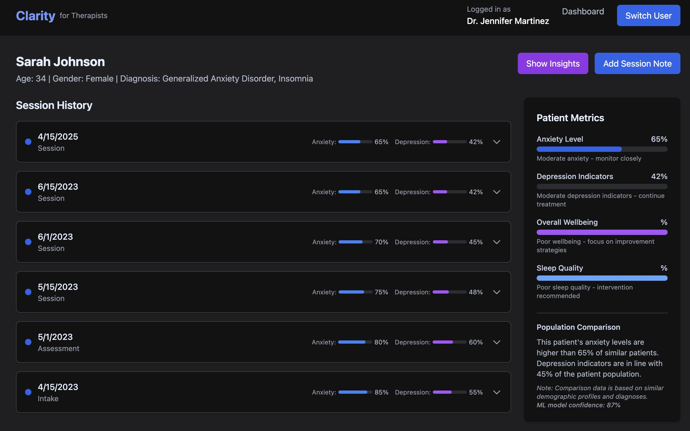

# Clarity: AI-Powered Therapy Assistant


A powerful AI assistant platform designed for mental health professionals. Clarity helps therapists enhance their clinical work with data-driven insights, practice sessions, and advanced patient analysis.

## Dashboard Overview



The Clarity dashboard provides a comprehensive view of your patient roster with AI-generated risk assessments, upcoming sessions, and treatment progress indicators. Therapists can quickly identify patients needing attention and access their complete history with a single click.

## Features

- **Patient History Timeline** - Track therapy progress and identify patterns over time
- **Therapeutic Rehearsal** - Practice different approaches with AI-simulated patient responses
- **Topic Detection** - Use machine learning to identify key therapeutic themes in session notes
- **Treatment Planning** - Create evidence-based plans with AI assistance
- **Condition Screening** - Get probability-based screening results for common conditions

### See Clarity in action!

<p align="center">
  
</p>

## Quick Setup

```bash
# Install dependencies
bun install

# Add OpenAI API key to .env.local
echo "VITE_OPENAI_API_KEY=your_key_here" > .env.local

# Run the app
bun run dev
```

## Technology

- React 19 with Vite
- Tailwind CSS
- Framer Motion
- OpenAI API integration
- Custom ML models for topic detection

## Security Note

This is a demonstration application. Do not use with real patient data.

[View Demo](https://pt8xs8-5173.csb.app/)
